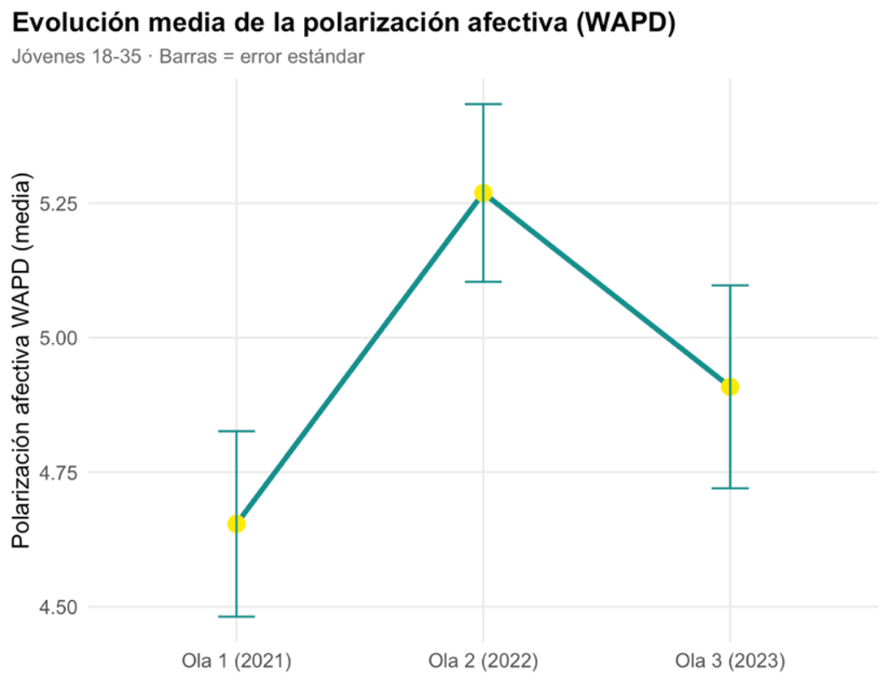
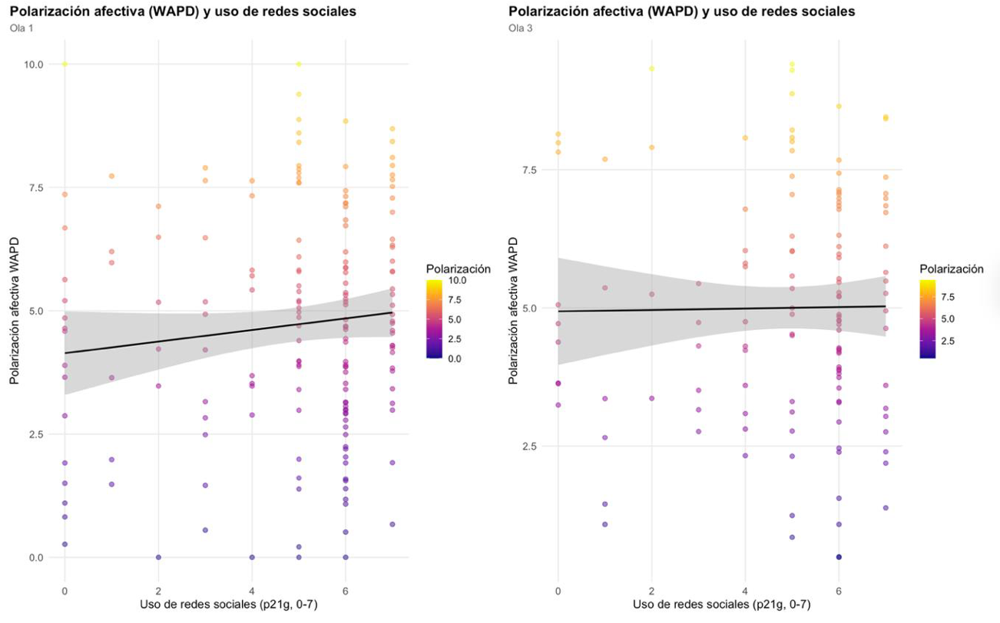
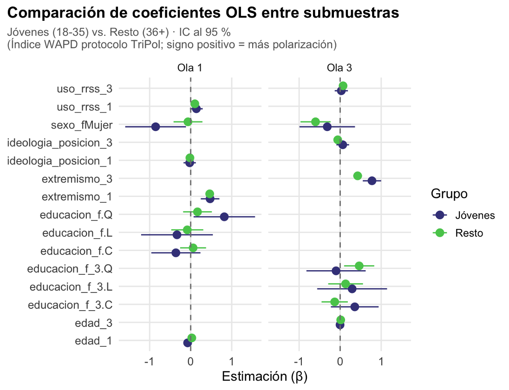
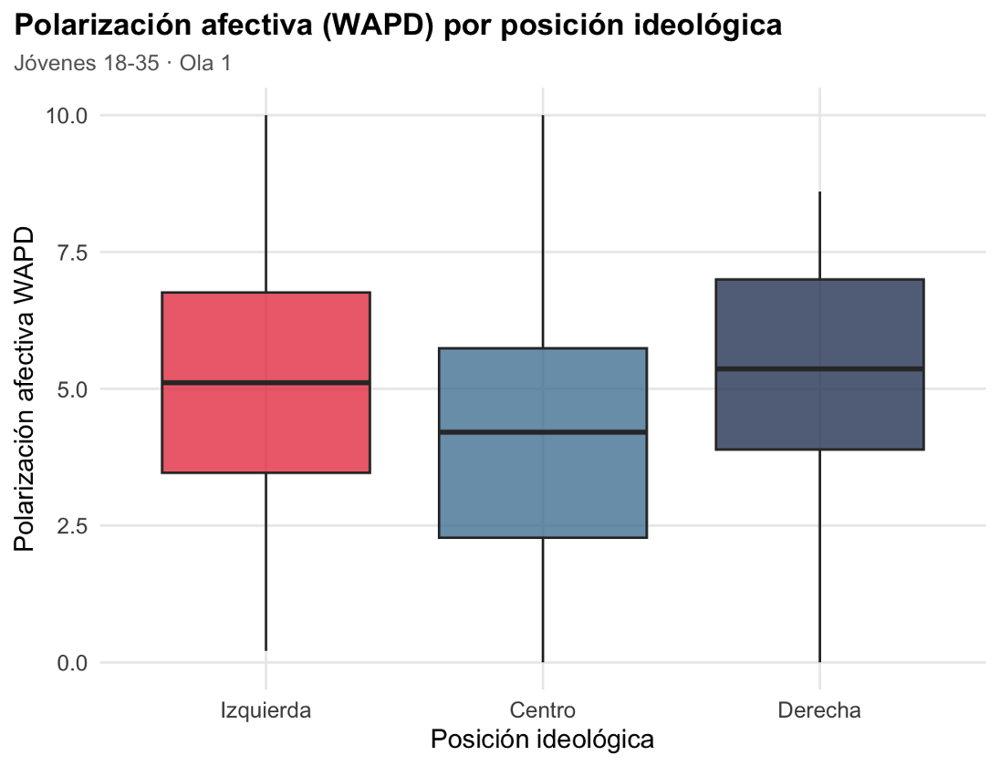

# Social Media Use and Affective Polarization

### A longitudinal quantitative analysis using R



This repository contains the code and selected materials from my Bachelor's Thesis in Sociology at the University of Salamanca.

The project investigates the relationship between informational social media use and affective polarization among young adults in Spain using longitudinal survey data from the **TriPol España** project.

---

## Project overview

- **Author:** Daniela Escudero Fernández
- **Degree:** Bachelor's Degree in Sociology
- **University:** University of Salamanca
- **Year:** 2026
- **Final grade:** 10/10
- **Software:** R / RStudio
- **Research design:** Longitudinal quantitative analysis

---

## Tools

- R

- RStudio

- tidyverse

- ggplot2

- dplyr

- longitudinal survey analysis

- OLS regression

---

## Research question

Does informational social media use increase affective polarization among young adults in Spain?

---

## Methodology

The analysis is based on longitudinal survey data from the TriPol España project (2021–2023).

The project includes:

- Data cleaning and preparation
- Construction of the WAPD (Weighted Affective Polarization Difference) index
- Descriptive statistics
- Ordinary Least Squares (OLS) regression models
- Longitudinal analyses
- Comparison between young adults (18–35) and older age groups

---

## Main findings

The analyses suggest that:

- Young adults show substantial levels of affective polarization across all three survey waves.
- Informational social media use was **not a consistent predictor** of affective polarization.
- Ideological extremism showed a stronger and more consistent association with affective polarization.
- The results suggest that online information consumption alone cannot explain political polarization among young adults.

---

## Selected figures

### Evolution of affective polarization


Average levels of affective polarization among young adults across the three survey waves.

---

### Social media use and affective polarization



Relationship between informational social media use and affective polarization.

---

### Comparison of OLS coefficients



Comparison of regression coefficients between young adults and older participants.

---

### Affective polarization by ideological position



Distribution of affective polarization according to ideological self-placement.

---

## Repository contents

```
analysis.R               Main analysis script
README.md                Project documentation
figures/                 Selected figures
```

---

## Data availability

The original dataset is **not included** in this repository.

The analyses were conducted using the TriPol España survey. Users interested in reproducing the analyses should obtain the original dataset from its corresponding data provider.

---

## Contact

**Daniela Escudero Fernández**

LinkedIn:
www.linkedin.com/in/daniela-escudero-fernandez-4a09b3375

GitHub:
github.com/daniescu22
